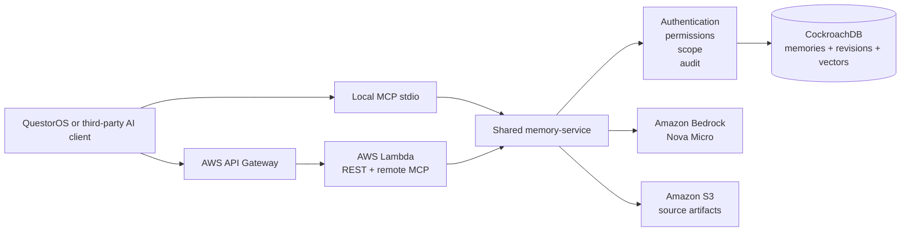

# QuestorOS Memory

**ICARE³™ — Agentic Persistent Memory for Organizational Intelligence**

> QuestorOS Memory preserves organizational reasoning, decisions, actions, outcomes, revisions, and provenance so separate AI sessions can build on trusted context instead of starting over.

QuestorOS Memory is a portable, explainable, user-controlled memory layer for AI agents. It exposes authenticated REST and MCP interfaces over one shared authorization and governance service.

> Hackathon staging MVP. The service is deployed for controlled judging and testing but is not represented as production-ready.

## Why this exists

Organizations increasingly use multiple AI assistants, but the reasoning created in those interactions is usually fragmented across people, chats, vendors, and sessions. Traditional document storage preserves files; it does not preserve governed agent memory with scope, history, provenance, retrieval explanations, and explicit human review boundaries.

QuestorOS Memory turns that missing layer into a standalone service that can support QuestorOS and third-party AI clients without replacing the client, model, or workflow system already in use.

## Live status

Phase 8A–8D are complete:

- CockroachDB-backed organizational memory and native vector retrieval;
- tenant, workspace, and project authorization boundaries;
- authenticated REST deployed through AWS API Gateway and Lambda;
- authenticated stateless remote MCP through the same Lambda and service layer;
- Amazon Bedrock reasoning with Nova Micro;
- proposal-only governed harvesting with zero automatic authoritative writes;
- correction history, provenance, explainable retrieval, soft deletion, and audit events;
- an immutable five-tool remote read-only allowlist;
- live cross-session retrieval, correction, history, isolation, governance, and exact cleanup proof; and
- a $5 monthly AWS staging budget with no provisioned Bedrock throughput.

Remote MCP endpoint:

```text
https://blrt2ds22f.execute-api.ap-southeast-1.amazonaws.com/staging/mcp
```

The endpoint requires a private project-scoped bearer key. A temporary read-only judge credential will be supplied only through private Devpost testing instructions, never committed to this repository.

## What the live demonstration proved

The Phase 8D synthetic demonstration completed successfully across three independent client sessions:

1. Session 1 created one synthetic authoritative project memory through authenticated REST.
2. Session 2 retrieved it through remote MCP `list`, explainable `search`, and `get`.
3. A controlled REST correction created immutable revision 2.
4. Session 3 retrieved the corrected content and both revisions through remote MCP.
5. Cross-project access was denied.
6. A non-allowlisted remote write remained blocked.
7. One bounded Bedrock harvest produced one pending proposal and changed no authoritative memory.
8. All demo-created records were removed and the original active-memory set was restored exactly.

No customer data, private QuestorOS data, API key, database URL, AWS credential, raw model output, or private chain-of-thought was included in the demo report.

## Exact remote MCP allowlist

```text
questoros_memory_whoami
questoros_memory_get
questoros_memory_list
questoros_memory_search
questoros_memory_history
```

The remote endpoint does not expose create, correct, delete, embedding mutation, harvest, candidate review, publication, synchronization, SQL, or administrative tools.

## Architecture



REST and MCP call `@questoros-memory/memory-service`. Transport code does not duplicate business rules or access Prisma directly.

See [`docs/architecture.md`](docs/architecture.md).

## CockroachDB tools used

The submission uses at least two required CockroachDB capabilities meaningfully:

### 1. CockroachDB Distributed Vector Indexing

- `vector(1024)` embeddings are stored beside scoped memory records.
- `memory_embeddings_scope_cosine_idx` uses `vector_cosine_ops`.
- retrieval combines authorization filters, explainable scoring, metadata, and vector similarity;
- vector verification uses synthetic nearest-neighbor checks and rolls test data back safely.

### 2. CockroachDB Cloud Managed MCP Server

- used as a separate read-only administrative development connection;
- verifies schema, tables, indexes, retrieval behavior, and operational recommendations;
- never acts as the customer-facing product interface;
- never receives the application SQL password or write permission.

The customer-facing QuestorOS Memory MCP server is a separate controlled product layer over `memory-service`, not a raw database MCP connection.

## AWS services used

- **AWS Lambda** — serverless REST, remote MCP, and governed-harvest execution.
- **Amazon API Gateway** — HTTPS staging ingress and throttling.
- **Amazon Bedrock** — bounded structured reasoning through `us.amazon.nova-micro-v1:0`.
- **Amazon S3** — bounded source-artifact storage for governed harvesting.
- **Amazon CloudWatch** — operational logs, request correlation, and alarms.
- **AWS IAM** — least-privilege runtime access with no wildcard Bedrock permissions.
- **AWS Budgets** — $5 monthly staging budget boundary.

The AWS stack is deployed in Singapore (`ap-southeast-1`). The Bedrock reasoning client runs in `us-west-2` using the approved US cross-Region inference profile.

## ICARE³ reasoning lifecycle

Public lifecycle:

> **Issue → Context → Analysis → Recommendations → Evaluation → Execution → Evaluation**

Internally, the two Evaluation stages are distinguished as `RECOMMENDATION_EVALUATION` and `EXECUTION_EVALUATION`.

## Governance model

```text
Authorized source
      |
      v
Untrusted source artifact
      |
      v
Bedrock structured extraction
      |
      v
Strict JSON + Zod validation
      |
      v
PENDING proposal candidates
      |
      v
Explicit human review boundary
      |
      +--> approve through governed action
      +--> reject through governed action
```

The model cannot approve, publish, correct, delete, or directly create authoritative memory.

## Quick local validation

Requirements:

- Node.js 24 LTS recommended;
- pnpm 11;
- a CockroachDB connection only for opt-in integration and demo operations;
- private credentials stored in ignored local files only.

```bash
pnpm install --frozen-lockfile
pnpm typecheck
pnpm lint
pnpm test
pnpm build
```

Full local setup: [`docs/development.md`](docs/development.md).

## Judge and submission material

- [`docs/judge-guide.md`](docs/judge-guide.md) — fastest evaluation path and private test-key handling.
- [`docs/devpost-submission.md`](docs/devpost-submission.md) — copy-ready submission description.
- [`docs/video-script.md`](docs/video-script.md) — less-than-three-minute recording plan.
- [`docs/cost-and-cleanup.md`](docs/cost-and-cleanup.md) — cost boundaries and post-judging teardown.
- [`docs/phase-8-remote-mcp-demo.md`](docs/phase-8-remote-mcp-demo.md) — reproducible setup, verification, and cleanup.
- [`docs/pre-existing-work.md`](docs/pre-existing-work.md) — required prior-work disclosure.

## Security

Read [`SECURITY.md`](SECURITY.md), [`docs/security.md`](docs/security.md), and [`docs/threat-model.md`](docs/threat-model.md) before connecting credentials or external tools.

Key controls include bearer authentication before MCP initialization, project-scoped authorization, deny-by-default browser origins, sanitized errors, request IDs, no-store responses, a remote read-only allowlist, proposal-only model output, least-privilege IAM, and exact synthetic cleanup.

## Repository and license

This is the standalone hackathon implementation of **QuestorOS Memory: Agentic Memory as a Service**. The broader QuestorOS product and earlier internal memory concepts predate the hackathon and are disclosed separately. This repository does not contain or deploy the broader QuestorOS application.

Licensed under the [Apache License 2.0](LICENSE).