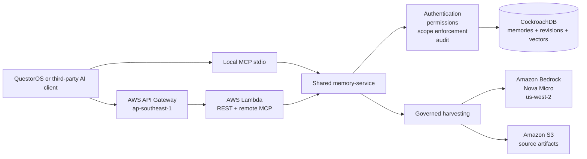
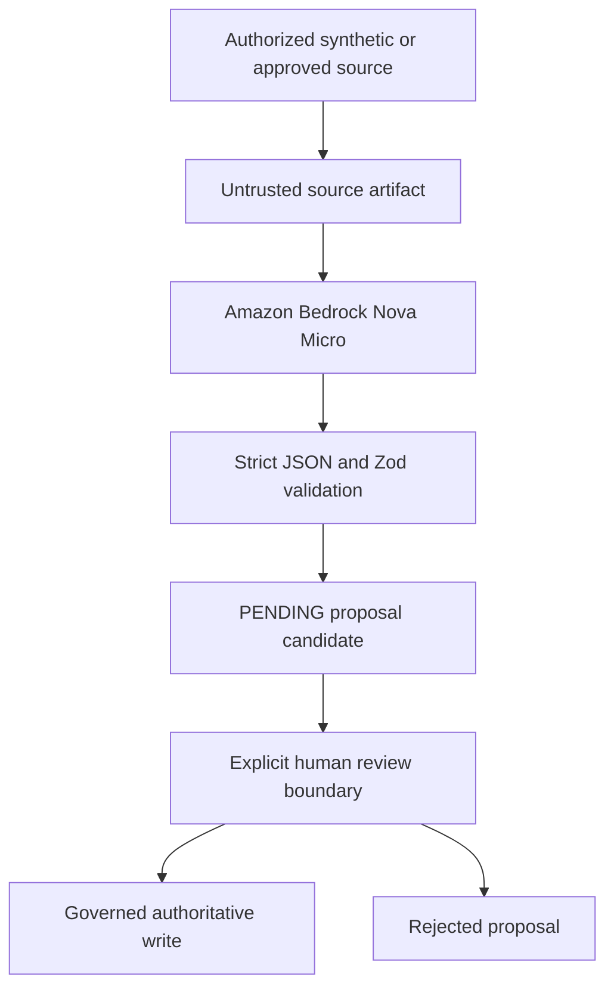

# Architecture

> Current staging baseline: authenticated REST and authenticated read-only remote MCP are deployed through one AWS Lambda; local stdio MCP remains supported; live Amazon Bedrock reasoning creates governed proposals without automatic authoritative-memory writes.

## Product path



REST and MCP transports do not duplicate business rules or access Prisma directly. Both call the same `@questoros-memory/memory-service` transport helpers.

## Deployed staging boundary

The AWS staging stack is in Singapore (`ap-southeast-1`) and includes:

- one API Gateway HTTP API;
- one Lambda for REST, remote MCP, and governed harvesting;
- CloudWatch logs and alarms;
- one S3 bucket for bounded source artifacts;
- least-privilege Bedrock invoke permissions; and
- a $5 monthly AWS budget.

The remote MCP endpoint reuses the existing API Gateway proxy route and Lambda:

```text
https://blrt2ds22f.execute-api.ap-southeast-1.amazonaws.com/staging/mcp
```

No second Lambda, API, database, queue, IAM role, or provisioned Bedrock service was created for remote MCP.

The Lambda reasoning client uses `us-west-2` and the approved US cross-Region inference profile `us.amazon.nova-micro-v1:0`. The profile may route only within its permitted US geography.

No production QuestorOS infrastructure is managed by this repository.

## Lambda protocol split

API Gateway events are not real Node `IncomingMessage` and `ServerResponse` streams. The final Lambda adapter therefore uses two explicit paths:

```text
REST request
   |
   v
Fastify injection

/mcp request
   |
   v
Web Request mapping
   |
   v
MCP SDK Web Standards Streamable HTTP transport
```

This separation avoids running Node HTTP socket cleanup against a synthetic Fastify socket. It also keeps the MCP protocol response separate from sanitized diagnostics.

## Remote MCP security boundary

Authentication happens before MCP initialization or tool discovery. The first remote release exposes exactly five read-only tools:

```text
questoros_memory_whoami
questoros_memory_get
questoros_memory_list
questoros_memory_search
questoros_memory_history
```

The remote endpoint:

- accepts a private database-backed bearer key;
- preserves tenant, workspace, and project scope;
- calls `memory-service` for every operation;
- denies browser origins unless explicitly allowlisted;
- returns sanitized JSON-RPC and tool errors;
- adds a sanitized request ID;
- sends `Cache-Control: no-store` and `X-Content-Type-Options: nosniff`; and
- does not expose create, correct, delete, embedding mutation, harvest, review, publication, synchronization, SQL, or administrative tools.

## CockroachDB as the memory system of record

CockroachDB stores:

- tenants, workspaces, projects, actors, and API keys;
- authoritative memories;
- immutable memory revisions;
- memory embeddings;
- source artifacts;
- memory audit events;
- harvest runs and proposal candidates; and
- publication metadata where explicitly enabled.

Memory retrieval combines authorization filters, structured metadata, provenance, and vector similarity. The vector layer uses 1,024-dimensional embeddings and the `memory_embeddings_scope_cosine_idx` cosine index.

## Two distinct MCP layers

### CockroachDB Cloud Managed MCP Server

```text
Cursor or approved development client
              |
              v
CockroachDB Cloud Managed MCP Server
              |
              v
Read-only schema inspection, diagnostics, and recommendations
```

The Managed MCP Server is a separate administrative development connection. It receives read-only authorization and never receives the application SQL password.

### QuestorOS Memory MCP Server

```text
Customer or judge MCP client
              |
              v
QuestorOS Memory remote MCP
              |
              v
memory-service authorization and governance
              |
              v
CockroachDB scoped memory records
```

The customer-facing server exposes controlled memory semantics instead of raw SQL.

## Governed reasoning path



The model cannot approve, publish, correct, delete, or directly create authoritative memory. Live acceptance confirmed proposal creation with zero automatic authoritative-memory writes.

## Live acceptance evidence

Phase 8C proved authenticated remote MCP initialization, exact five-tool discovery, project scope, deny-by-default browser origins, remote-write denial, and zero authoritative-memory writes.

Phase 8D proved:

- persistent retrieval across three independent client sessions;
- list, explainable search, get, and history;
- actor and metadata provenance;
- cross-project denial;
- one controlled correction and two immutable revisions;
- one pending Bedrock proposal with no authoritative change; and
- exact removal of all synthetic authoritative and proposal records.

## ICARE³ lifecycle (`metadata.icare`)

Public lifecycle:

> Issue → Context → Analysis → Recommendations → Evaluation → Execution → Evaluation

Internal stages include `RECOMMENDATION_EVALUATION` and `EXECUTION_EVALUATION` for the two evaluation steps.

## Infrastructure decisions

- CockroachDB plan: Basic;
- CockroachDB cloud and region: AWS Singapore (`ap-southeast-1`);
- AWS staging region: Singapore (`ap-southeast-1`);
- Bedrock reasoning client Region: `us-west-2`;
- approved reasoning profile: `us.amazon.nova-micro-v1:0`;
- provisioned Bedrock throughput: none;
- embedding auto-on-write: disabled;
- remote browser-origin allowlist: empty in staging;
- remote MCP write tools: none; and
- existing QuestorOS production infrastructure: outside this repository.
